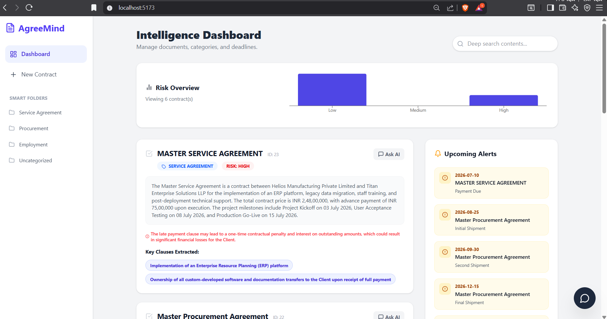
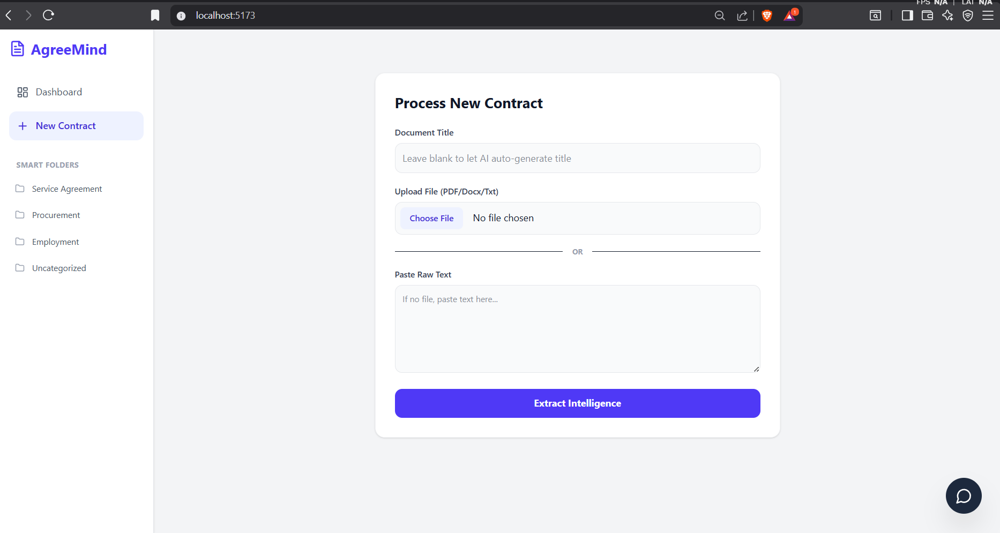

# AgreeMind

A local-first legal intelligence dashboard. Built for the Imagine Hackathon.



## What is this?
Reading legal contracts sucks. Especially for freelancers and small businesses who don't have lawyers on retainer. But pasting sensitive, confidential NDAs or leases into public AI models like ChatGPT is a massive privacy risk.

I built AgreeMind to solve this. It's a full-stack dashboard that parses contracts, flags risks, and extracts payment deadlines—but it runs the LLM (Llama 3.2) entirely locally on your machine via Ollama. Zero data leaves your computer.

## Features
- **100% Local AI:** No OpenAI API keys, no cloud data leaks. Uses Ollama and Llama 3.2 2B entirely on your machine.
- **Multi-Format Parsing:** Handles PDFs, DOCX, and raw text formats.
- **Automated Extraction:** Instantly pulls out key clauses, risk levels, and 3-sentence executive summaries based on the text.
- **Deadline Aggregator:** Finds critical renewal and payment dates and pins them to an interactive alert panel.
- **Contextual 'Ask AI' Chat:** Click 'Ask AI' on any contract to open a chat tied specifically to that document's text for nuanced legal advice.
- **Agentic System Manager:** A global chat assistant that can actually execute database updates in Supabase through natural language commands (e.g., "Change document #2 category to NDA").



## Tech Stack
* **Frontend:** React, Tailwind CSS v4, Lucide Icons, Recharts
* **Backend:** Node.js, Express, Multer
* **Database:** Supabase (PostgreSQL)
* **AI:** Ollama (Llama 3.2 2B)
* **File Parsing:** pdf2json, mammoth

## How to run locally
You will need Node.js and Ollama installed.

First, pull the model:
`ollama pull llama3.2`

Then start the backend:
```bash
cd server
npm install
node index.js
